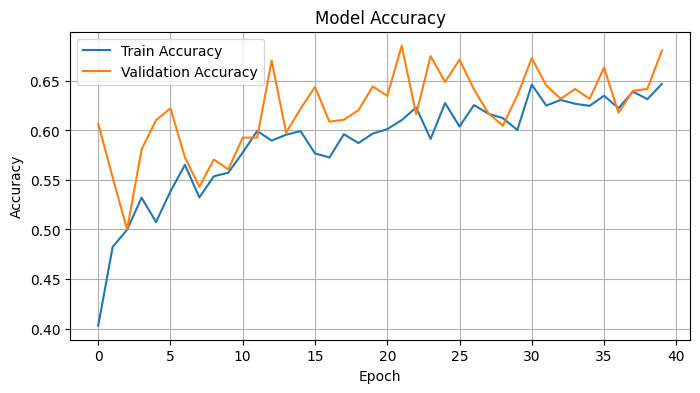
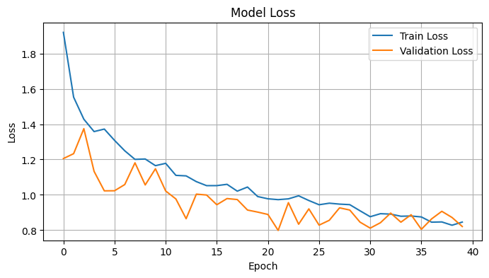

# Skin Lesion Classifier

## Project Overview

This project aims to develop a robust deep learning model(CNN) capable of accurately classifying various types of skin lesions from dermatoscopic images. Leveraging the **HAM10000 dataset**, the project encompasses the entire machine learning pipeline, from initial data exploration and preprocessing to model training, and evaluation.

## Data Insights & Preprocessing

* **Dataset**: [HAM10000](https://www.kaggle.com/datasets/kmader/skin-cancer-mnist-ham10000), with dermatoscopic images of pigmented skin lesions.
* **Data Volume**: 10,015 images from 7,470 unique lesions.
* **Lesion Types**: 7 categories — `akiec`, `bcc`, `bkl`, `df`, `mel`, `nv`, `vasc`.
* **Missing Data**: 57 entries missing in the `age` column.
* **Class Imbalance**: Addressed using computed **class weights**.
* **Split Ratios** (based on `lesion_id`):
    * **Train**: 6,045 samples
    * **Validation**: 1,994 samples
    * **Test**: 1,976 samples
* **Label Encoding**: Lesion type strings encoded as integers from 0 to 6.

---

## Data Pipeline & Augmentation

* **Image Rescaling**: Normalize pixel values to range [0, 1].
* **Augmentation Techniques**:
    * Rotation: ±20 degrees
    * Flipping: Horizontal and vertical
    * Zoom: Up to 20%
* **Data Loading**: Utilizes `ImageDataGenerator` with `flow_from_dataframe` for efficient batched training with augmentation.

---

## Model Architecture

### VGG16

* **Base Model**: **VGG16** pretrained on ImageNet, with frozen convolutional layers.
* **Classification Head**:
    * `Flatten`
    * `Dense(256, activation='relu')`
    * `Dropout(0.5)`
    * `Dense(7, activation='softmax')` — for 7-class prediction

---

### DenseNet121

* **Base Model**: **DenseNet121** pretrained on ImageNet, with frozen convolutional layers.
* **Classification Head**:
    * `Flatten`
    * `Dense(256, activation='relu')`
    * `Dropout(0.5)`
    * `Dense(7, activation='softmax')` — for 7-class prediction

---

## Model Training and Evaluation Setup

* **Loss Function**: `categorical_crossentropy`
* **Optimizer**: `Adam` with learning rate `1e-4`
* **Evaluation Metric**: `accuracy` (along with F1-score, precision, recall for deeper analysis)
* **Callback**: `EarlyStopping` (patience = 3 for VGG16, patience = 5 for DenseNet121; monitor = `val_loss`, restore best weights)

---

### Training Results (VGG16)

The model was trained for 40 epochs. The training history plots shows the progression of accuracy and loss on both the training and validation datasets.

**Accuracy Plot:**

**Loss Plot:**

---

### Training Results (DenseNet121)

The model was trained for 40 epochs. The training history plots shows the progression of accuracy and loss on both the training and validation datasets.

**Accuracy Plot:**

**Loss Plot:**

---

## Model Saving

The trained models are saved in the Keras format:
* `VGG16_skin_lesion_model.keras`
* `DenseNet121_skin_lesion_model.keras`